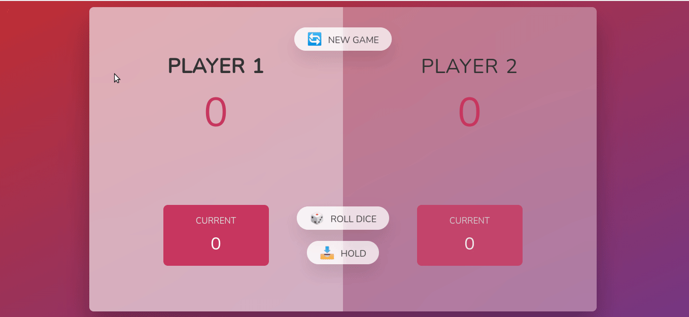

# Pig-Game 🎲🎲🎲

> # Description / Descrição

A pig game made with JavaScript. This project is a practice of DOM manipulation.
Players take turns to roll a single die as many times as they wish, adding all roll results to a running total, but losing their gained score for the turn if they roll a 1.

[🔗 Click here to access / Clique aqui para acessar](https://pig-game-vitorfnery.netlify.app/)

## 🛠️ Technologies / Tecnologias

- JavaScript
- HTML
- CSS
- Git e Github

## 📣 Contact / Contato

vitorfelipenery@gmail.com
